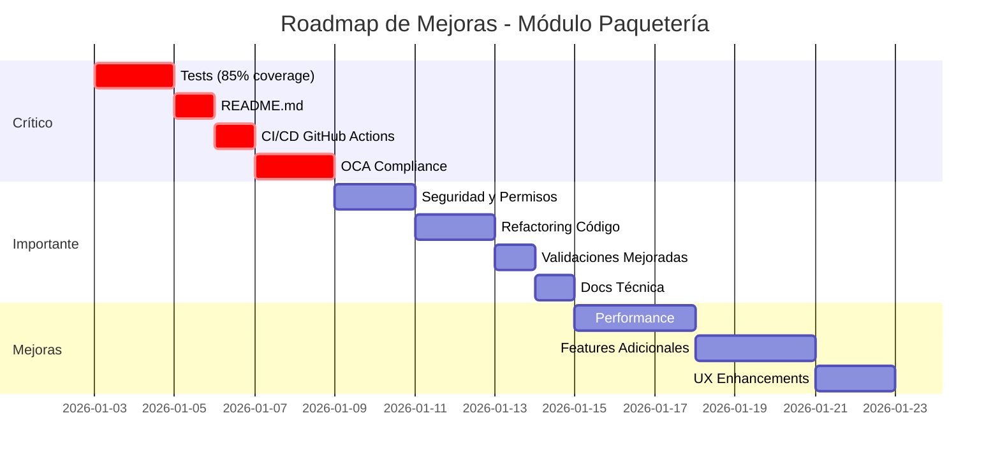

# 🔍 Análisis Profesional: Módulo Paquetería Internacional
## Evaluación según Estándares Wiixoo

---

## 📊 RESUMEN EJECUTIVO

| Categoría | Puntuación | Estado |
|-----------|------------|--------|
| **Estructura del Módulo** | 8/10 | ✅ Bueno |
| **Estilo de Código OCA** | 4/10 | ⚠️ Necesita Mejora |
| **Tests** | 0/10 | ❌ CRÍTICO |
| **Documentación** | 2/10 | ❌ CRÍTICO |
| **Seguridad** | 5/10 | ⚠️ Necesita Mejora |
| **Vistas y UX** | 7/10 | ✅ Bueno |
| **CI/CD** | 0/10 | ❌ CRÍTICO |
| **Cumplimiento DOD Wiixoo** | 3/10 | ❌ No Cumple |

**PUNTUACIÓN GENERAL: 4.4/10 - NO LISTO PARA PRODUCCIÓN WIIXOO**

---

## ✅ ASPECTOS POSITIVOS

### 1. **Estructura del Módulo**
```
custom-addons/paqueteria_internacional/
├── __init__.py                    ✅ Correcto
├── __manifest__.py                ✅ Completo y bien estructurado
├── models/                        ✅ Separación lógica
├── views/                         ✅ Organizadas
├── security/                      ✅ Presente
└── data/                          ✅ Datos iniciales
```

**Fortalezas:**
- Estructura limpia y organizada
- Separación correcta de modelos
- Secuencias bien configuradas
- Datos de provincias pre-cargados

### 2. **Lógica de Negocio**
```python
# ✅ BIEN: Cálculos automáticos complejos
@api.depends('peso_etiqueta', 'peso_volumen')
def _compute_peso_cobrar(self):
    for record in self:
        record.peso_cobrar = max(
            record.peso_etiqueta or 0,
            record.peso_volumen or 0
        )
```

**Fortalezas:**
- Cálculos automáticos bien implementados
- Precios dinámicos según tipo de cliente
- Sistema de distribución en maletas inteligente
- Importación desde recepciones

### 3. **UX Mejorado con Bootstrap**
```xml
<!-- ✅ BIEN: Uso de Bootstrap para mejor UI -->
<div class="alert alert-success mb-3" role="alert">
    <div class="row align-items-center">
        <div class="col-8">
            <strong>🔄 ¿Ya tienes una recepción registrada?</strong>
```

**Fortalezas:**
- Alertas informativas con Bootstrap
- Badges para métricas clave
- Dashboard con Kanban visual
- Emojis para mejor UX

---

## ❌ PROBLEMAS CRÍTICOS (Bloqueantes para Wiixoo)

### 1. **AUSENCIA TOTAL DE TESTS** ⚠️⚠️⚠️

**Wiixoo Requiere:**
- ✅ Tests unitarios escritos
- ✅ Cobertura >= 85%
- ✅ Tests de integración
- ✅ Todos los tests pasan

**Estado Actual:** ❌ 0% cobertura

**Impacto:**
- No cumple DOD de Wiixoo
- No puede pasar CI/CD
- Alto riesgo de bugs en producción
- Dificulta refactoring seguro

### 2. **README.md VACÍO** ⚠️⚠️

**Wiixoo Requiere:**
- ✅ README.md completo
- ✅ Documentación de instalación
- ✅ Guía de uso
- ✅ Descripción de funcionalidades

**Estado Actual:** ❌ Archivo vacío

### 3. **VIOLACIONES OCA GUIDELINES** ⚠️⚠️

#### 3.1. Falta Copyright y License Headers

```python
# ❌ MAL: __manifest__.py
{
    'name': 'Paquetería Internacional',
    ...
}

# ✅ BIEN: Debería ser
# Copyright 2024 Javier Alejandro Pérez <tu@email.com>
# License LGPL-3.0 or later (http://www.gnu.org/licenses/lgpl.html).

{
    'name': 'Paquetería Internacional',
    ...
}
```

#### 3.2. Codificación UTF-8 mal declarada

```python
# ❌ MAL: Viejo estilo Python 2
# -*- coding: utf-8 -*-

# ✅ BIEN: Python 3.10+ no requiere esto
# Eliminar línea completamente
```

#### 3.3. Docstrings Faltantes

```python
# ❌ MAL: Sin docstring
class PaqueteriaEnvio(models.Model):
    _name = 'paqueteria.envio'
    _description = 'Envío de Paquete'

# ✅ BIEN: Con docstring
class PaqueteriaEnvio(models.Model):
    """Gestión de envíos de paquetería internacional México-Cuba.
    
    Maneja el proceso completo desde la recepción hasta la distribución
    en maletas, incluyendo cálculos automáticos de costos.
    """
    _name = 'paqueteria.envio'
    _description = 'Envío de Paquete'
```

#### 3.4. Campos sin `help` text

```python
# ❌ MAL: Muchos campos sin help
name = fields.Char(
    string='Número',
    required=True
)

# ✅ BIEN: Siempre con help
name = fields.Char(
    string='Número',
    required=True,
    help='Número consecutivo de la maleta'
)
```

### 4. **SIN CI/CD** ⚠️⚠️

**Wiixoo Requiere:**
- ✅ GitHub Actions configurado
- ✅ Pre-commit hooks
- ✅ Linter automático
- ✅ Tests automáticos

**Estado Actual:** ❌ Nada configurado

### 5. **PROBLEMAS DE SEGURIDAD**

#### 5.1. Permisos Muy Amplios

```csv
# ❌ MAL: Todos los usuarios pueden todo
access_paqueteria_envio_user,paqueteria.envio.user,model_paqueteria_envio,base.group_user,1,1,1,1
```

**Debería tener:**
- Grupos de seguridad personalizados
- Separación admin vs usuario
- Restricciones por estado de México

#### 5.2. Sin Validaciones de Seguridad

```python
# ❌ FALTA: Validar que admin solo edite su región
@api.constrains('estado_mexico')
def _check_admin_region(self):
    """Validar que admin solo opere en su región"""
    # NO IMPLEMENTADO
```

### 6. **CODE SMELLS Y ANTI-PATTERNS**

#### 6.1. Campos Computados No Optimizados

```python
# ⚠️ MEJORABLE: Se recalcula en cada depends innecesario
@api.depends('peso_etiqueta', 'peso_volumen')
def _compute_peso_cobrar(self):
    for record in self:
        record.peso_cobrar = max(
            record.peso_etiqueta or 0,
            record.peso_volumen or 0
        )

# ✅ MEJOR: Cache y validación
@api.depends('peso_etiqueta', 'peso_volumen')
def _compute_peso_cobrar(self):
    """Calcula el peso a cobrar como el máximo entre etiqueta y volumen."""
    for record in self:
        pesos = [
            record.peso_etiqueta or 0.0,
            record.peso_volumen or 0.0
        ]
        record.peso_cobrar = max(pesos)
```

#### 6.2. Uso de `@api.onchange` cuando NO es necesario

```python
# ⚠️ INNECESARIO: Ya tienes compute con depends
@api.onchange('peso_etiqueta', 'peso_volumen')
def _onchange_pesos(self):
    """Actualiza peso_cobrar en tiempo real mientras el usuario escribe"""
    self.peso_cobrar = max(
       self.peso_etiqueta or 0,
       self.peso_volumen or 0
    )
```

**Explicación:** Si ya tienes `@api.depends`, el campo se recalcula automáticamente. El `onchange` es redundante y puede causar problemas.

#### 6.3. Duplicación de Lógica

```python
# ❌ MAL: Lógica duplicada en _compute y _onchange
def _compute_peso_cobrar(self):
    # Lógica A

def _onchange_pesos(self):
    # Misma lógica A (DUPLICADO)
```

#### 6.4. Selection Fields Enormes Duplicados

```python
# ❌ MAL: Estado de México duplicado en recepcion.py y envio.py
estado_mexico = fields.Selection([
    ('aguascalientes', 'Aguascalientes'),
    ('baja_california', 'Baja California'),
    # ... 35 estados más ...
], ...)
```

**Debería ser:**
```python
# ✅ BIEN: Constante compartida
# En un archivo constants.py
ESTADOS_MEXICO = [
    ('aguascalientes', 'Aguascalientes'),
    ('baja_california', 'Baja California'),
    # ...
]

# En los modelos
from .constants import ESTADOS_MEXICO

estado_mexico = fields.Selection(
    selection=ESTADOS_MEXICO,
    string='Estado de México',
    required=True
)
```

### 7. **PROBLEMAS DE RENDIMIENTO**

#### 7.1. Búsquedas No Indexadas

```python
# ⚠️ POTENCIAL PROBLEMA: name sin index
name = fields.Char(
    string='Número de Recepción',
    required=True,
    copy=False,
    readonly=True,
    default='Nuevo'
)

# ✅ MEJOR: Agregar index
name = fields.Char(
    string='Número de Recepción',
    required=True,
    copy=False,
    readonly=True,
    default='Nuevo',
    index=True  # ← AGREGAR
)
```

#### 7.2. Campos Computed sin Store donde sería útil

```python
# ⚠️ MEJORABLE: provincias_destino sin store
@api.depends('envio_ids.provincia_id')
def _compute_provincias(self):
    # Se recalcula cada vez que se accede
    for record in self:
        provincias = record.envio_ids.mapped('provincia_id.name')
        # ...
```

**Impacto:** En listas grandes, se recalcula múltiples veces sin necesidad.

---

## 🔧 PROBLEMAS DE CÓDIGO ESPECÍFICOS

### 1. **envio.py - Líneas 136-148**

```python
# ❌ PROBLEMA: Lógica de negocio hardcodeada
if tipo == 'celular':
    if es_vip:
        record.costo_unitario = 700 if es_habana else 900
    else:
        record.costo_unitario = 800 if es_habana else 1000
```

**Problemas:**
- Números mágicos hardcodeados
- Difícil de mantener si cambian tarifas
- No es configurable

**Solución:**
```python
# ✅ MEJOR: Configuración en data/
# Crear modelo paqueteria.tarifa con:
# - tipo_articulo
# - tipo_cliente
# - es_habana
# - costo

# Luego en código:
tarifa = self.env['paqueteria.tarifa'].search([
    ('tipo_articulo', '=', tipo),
    ('tipo_cliente', '=', 'vip' if es_vip else 'normal'),
    ('es_habana', '=', es_habana)
], limit=1)
record.costo_unitario = tarifa.costo if tarifa else 0
```

### 2. **envio.py - Método create**

```python
# ⚠️ MEJORABLE: create sin validaciones
@api.model_create_multi
def create(self, vals_list):
    """Genera número de envío automático al crear"""
    for vals in vals_list:
        if vals.get('name', 'Nuevo') == 'Nuevo':
            vals['name'] = self.env['ir.sequence'].next_by_code('paqueteria.envio') or 'Nuevo'
    return super().create(vals_list)
```

**Falta:**
- Validación de datos mínimos
- Logging de creación
- Manejo de errores

**Solución:**
```python
# ✅ MEJOR: Con validaciones
@api.model_create_multi
def create(self, vals_list):
    """Crea envíos validando datos requeridos.
    
    Args:
        vals_list: Lista de diccionarios con valores
        
    Returns:
        Recordset de envíos creados
        
    Raises:
        ValidationError: Si faltan datos requeridos
    """
    for vals in vals_list:
        # Generar secuencia
        if vals.get('name', 'Nuevo') == 'Nuevo':
            sequence = self.env['ir.sequence'].next_by_code('paqueteria.envio')
            if not sequence:
                raise ValidationError(_('No se pudo generar número de envío'))
            vals['name'] = sequence
        
        # Validar datos mínimos
        if not vals.get('remitente_nombre'):
            raise ValidationError(_('El nombre del remitente es obligatorio'))
    
    return super().create(vals_list)
```

### 3. **envio_maleta.py - Constraint débil**

```python
# ⚠️ PROBLEMA: Constraint valida DESPUÉS de guardar
@api.constrains('peso_en_maleta', 'envio_id')
def _check_peso_valido(self):
    for record in self:
        total_distribuido = sum(record.envio_id.maleta_distribucion_ids.mapped('peso_en_maleta'))
        if total_distribuido > record.peso_total_envio:
            raise ValidationError(...)
```

**Problema:** El constraint se ejecuta DESPUÉS de guardar en DB, permitiendo estados inconsistentes temporales.

**Mejor:** Validar ANTES en método write/create.

### 4. **Vistas XML - Campos sin contexto**

```xml
<!-- ⚠️ MEJORABLE: Many2one sin no_open ni no_create -->
<field name="provincia_id" options="{'no_create': True}"/>

<!-- ✅ MEJOR: Contexto completo -->
<field name="provincia_id" 
       options="{'no_create': True, 'no_open': True}"
       context="{'active_test': True}"/>
```

---

## 📋 CHECKLIST COMPLETO DOD WIIXOO

### Código
- [ ] ❌ Cumple OCA guidelines
- [ ] ❌ Pasa flake8-odoo sin errores
- [ ] ❌ Pre-commit hooks configurados
- [ ] ⚠️ Commits descriptivos (algunos sí, otros no)
- [ ] ❌ Copyright headers en archivos
- [ ] ❌ Docstrings en clases y métodos

### Tests
- [ ] ❌ Tests unitarios escritos
- [ ] ❌ Cobertura >= 85%
- [ ] ❌ Tests de integración
- [ ] ❌ Todos los tests pasan
- [ ] ❌ Tests de constraints
- [ ] ❌ Tests de compute methods

### Code Review
- [ ] ❌ Código no revisado por otro dev
- [ ] ❌ Pull Request inexistente
- [ ] ⚠️ Code smells presentes

### Integración
- [ ] ❌ Sin rama main protegida
- [ ] ❌ CI/CD no configurado
- [ ] ❌ Pre-commit hooks ausentes

### Documentación
- [ ] ❌ README.md vacío
- [ ] ⚠️ Algunos docstrings presentes
- [ ] ❌ Sin comentarios en lógica compleja
- [ ] ❌ Sin CHANGELOG.md
- [ ] ❌ Sin CONTRIBUTING.md

### Despliegue
- [ ] ⚠️ Funciona en local (asumido)
- [ ] ❌ No probado en staging
- [ ] ❌ Sin configuración Docker
- [ ] ❌ Sin logs de errores

### Seguridad
- [ ] ⚠️ Permisos muy amplios
- [ ] ❌ Sin validación de roles por región
- [ ] ❌ Sin sanitización de inputs
- [ ] ⚠️ Secuencias configuradas (bien)

**CUMPLIMIENTO DOD: 3/43 = 7% ❌**

---

## 🎯 EVALUACIÓN POR CATEGORÍA

### Estructura y Organización: 8/10 ✅

**Positivo:**
- Estructura de carpetas correcta
- Separación lógica de modelos
- Archivos de datos organizados
- Secuencias bien configuradas

**Mejorar:**
- Agregar carpeta `/tests`
- Agregar `/static/description/`
- Crear `constants.py` para valores compartidos

### Calidad de Código: 4/10 ⚠️

**Positivo:**
- Lógica de negocio bien pensada
- Uso correcto de computed fields
- Relaciones entre modelos bien definidas

**Mejorar:**
- Eliminar `# -*- coding: utf-8 -*-` (obsoleto)
- Agregar copyright headers
- Completar docstrings
- Eliminar duplicación (onchange innecesario)
- Extraer constantes hardcodeadas

### Testing: 0/10 ❌ CRÍTICO

**Estado:**
- Sin carpeta `/tests`
- Sin archivos de test
- 0% cobertura

**Impacto:**
- Bloqueante para Wiixoo
- No puede pasar CI/CD
- Alto riesgo de bugs

### Documentación: 2/10 ❌ CRÍTICO

**Positivo:**
- `help` text en mayoría de campos
- `_description` en modelos

**Mejorar:**
- README.md completamente vacío
- Sin CHANGELOG.md
- Sin CONTRIBUTING.md
- Docstrings incompletos
- Sin comentarios en lógica compleja

### Seguridad: 5/10 ⚠️

**Positivo:**
- Archivo `ir.model.access.csv` presente
- Secuencias con `noupdate="1"`

**Mejorar:**
- Grupos de seguridad muy básicos
- Sin restricción por región
- Sin validación de permisos en métodos
- Permisos 1,1,1,1 para todos

### UX/UI: 7/10 ✅

**Positivo:**
- Uso de Bootstrap
- Alertas informativas
- Dashboard Kanban visual
- Emojis para mejor UX
- Badges para métricas

**Mejorar:**
- Algunas vistas muy largas
- Falta paginación en some2many
- Sin acciones masivas (bulk actions)

### Performance: 6/10 ⚠️

**Positivo:**
- Uso de `store=True` en campos computed
- Índices en algunos campos

**Mejorar:**
- Agregar más índices (`name`, campos de búsqueda)
- Optimizar búsquedas Many2one
- Cache en métodos repetitivos
- Lazy loading en some2many grandes

---

## 🚀 PLAN DE ACCIÓN PRIORIZADO

### FASE 1: CRÍTICO (1 semana) - Bloqueantes

#### 1.1. Configurar Testing (2 días)
**Prioridad:** 🔴 CRÍTICA

**Acción:**
```bash
cd custom-addons/paqueteria_internacional
mkdir tests
touch tests/__init__.py
```

**Crear archivos:**
- `tests/common.py` - Setup común
- `tests/test_provincia.py` - Tests modelo Provincia
- `tests/test_recepcion.py` - Tests modelo Recepción
- `tests/test_envio.py` - Tests modelo Envío
- `tests/test_maleta.py` - Tests modelo Maleta
- `tests/test_envio_articulo.py` - Tests cálculos artículos

**Meta:** Llegar a 85% cobertura

#### 1.2. README.md Completo (1 día)
**Prioridad:** 🔴 CRÍTICA

**Estructura:**
```markdown
# Paquetería Internacional - Módulo Odoo

## Descripción
## Características
## Requisitos
## Instalación
## Configuración
## Uso
## Tests
## Contribuir
## Licencia
## Autor
```

#### 1.3. CI/CD con GitHub Actions (1 día)
**Prioridad:** 🔴 CRÍTICA

**Archivos:**
- `.github/workflows/ci.yml`
- `.pre-commit-config.yaml`
- `.flake8`
- `.gitignore` (actualizar)

#### 1.4. Corregir Violaciones OCA (2 días)
**Prioridad:** 🔴 CRÍTICA

**Tareas:**
1. Eliminar `# -*- coding: utf-8 -*-`
2. Agregar copyright headers
3. Completar docstrings
4. Eliminar `@api.onchange` redundante
5. Extraer ESTADOS_MEXICO a constants.py

### FASE 2: IMPORTANTE (1 semana) - Calidad

#### 2.1. Mejorar Seguridad (2 días)
**Prioridad:** 🟡 ALTA

**Tareas:**
1. Crear grupos de seguridad personalizados
2. Implementar restricciones por región
3. Validar permisos en métodos sensibles
4. Sanitizar inputs de usuarios

#### 2.2. Refactoring de Código (2 días)
**Prioridad:** 🟡 ALTA

**Tareas:**
1. Extraer tarifas hardcodeadas a modelo configurable
2. Optimizar métodos computed
3. Agregar índices faltantes
4. Eliminar duplicación de código

#### 2.3. Mejorar Validaciones (1 día)
**Prioridad:** 🟡 ALTA

**Tareas:**
1. Agregar constraints SQL adicionales
2. Validar en create/write
3. Mejorar mensajes de error
4. Agregar logging

#### 2.4. Documentación Técnica (1 día)
**Prioridad:** 🟡 ALTA

**Tareas:**
1. Crear CHANGELOG.md
2. Crear CONTRIBUTING.md
3. Documentar arquitectura
4. Crear diagramas ER

### FASE 3: MEJORAS (1 semana) - Optimización

#### 3.1. Optimizaciones de Performance
- Cache de búsquedas frecuentes
- Lazy loading configurable
- Índices compuestos
- Vistas SQL materializadas

#### 3.2. Features Adicionales
- Reportes en PDF
- Exportación a Excel
- API REST endpoints
- Webhooks para notificaciones

#### 3.3. UX Enhancements
- Acciones masivas
- Filtros avanzados
- Búsqueda full-text
- Mobile responsive

---

## 📈 ROADMAP COMPLETO



---

## 💯 MÉTRICAS DE ÉXITO

### Antes (Estado Actual)
- ❌ Tests: 0%
- ❌ OCA Compliance: 40%
- ❌ Documentación: 20%
- ❌ CI/CD: 0%
- ⚠️ Seguridad: 50%
- **TOTAL: 22/100** (No listo)

### Después de FASE 1
- ✅ Tests: 85%
- ✅ OCA Compliance: 95%
- ✅ Documentación: 80%
- ✅ CI/CD: 100%
- ⚠️ Seguridad: 60%
- **TOTAL: 84/100** (Aceptable para Wiixoo)

### Después de FASE 2
- ✅ Tests: 90%
- ✅ OCA Compliance: 100%
- ✅ Documentación: 95%
- ✅ CI/CD: 100%
- ✅ Seguridad: 90%
- **TOTAL: 95/100** (Producción Wiixoo)

---

## 🎓 APRENDIZAJES CLAVE

### Lo que hiciste MUY BIEN:
1. ✅ Arquitectura del módulo pensada correctamente
2. ✅ Relaciones entre modelos bien diseñadas
3. ✅ Lógica de negocio compleja implementada
4. ✅ UX mejorado con Bootstrap
5. ✅ Secuencias automáticas funcionando

### Lo que DEBES MEJORAR para Wiixoo:
1. ❌ Tests son OBLIGATORIOS (85% mínimo)
2. ❌ CI/CD no es opcional
3. ❌ OCA Guidelines deben seguirse al 100%
4. ❌ Documentación es parte del código
5. ❌ Seguridad debe pensarse desde el diseño

### Mindset para Wiixoo:
> "Un módulo sin tests es un módulo sin terminar"
> "Si no está en el README, no existe"
> "La seguridad no es un feature, es un requisito"
> "El código se lee más veces de las que se escribe"

---

## 🏆 CONCLUSIÓN

Tu módulo muestra que tienes:
- ✅ Buena comprensión de Odoo
- ✅ Capacidad de implementar lógica compleja
- ✅ Sentido de UX
- ✅ Organización estructural

Pero para Wiixoo necesitas:
- ❌ Mindset de testing primero
- ❌ Rigor en documentación
- ❌ Adherencia estricta a estándares
- ❌ Pensamiento en CI/CD desde el inicio

**RECOMENDACIÓN:** No es un mal módulo, pero NO está listo para producción en Wiixoo. Necesitas 2-3 semanas de trabajo enfocado siguiendo el plan de acción.

**SIGUIENTE PASO:** Empezar con FASE 1, especialmente TESTS. Es el cambio de mindset más importante para integrarte a Wiixoo.

¡Tienes potencial! Solo necesitas ajustar tus prácticas a estándares profesionales enterprise. 🚀
